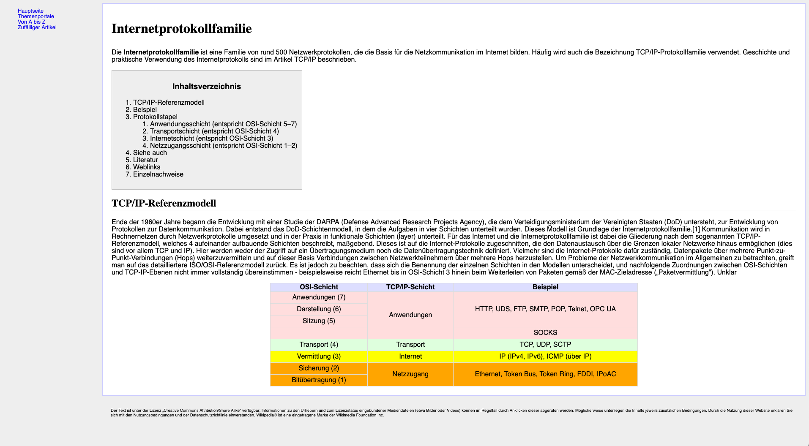

# Übung HTML und CSS
Erstelle die gesamte HTML Struktur von dieser abgspeckten Wikipedia-Seite gemäss Screenshot.

1. Erstelle zuerst die HTML Struktur. Achte dabei auf eine semantisch korrekte Struktur, verwende die HTML5 Strukturelemente und validiere am Schluss die Seite im HTML Validator.
   Die Nummerierung des Inhaltsverzeichnis ist nicht HTML Standart. Du kannst dafür eine normale verschachtelte nummerierte Liste verwenden.
2. Gestalte die Seite mittels CSS. Verwende dazu das Grid-Layout.

