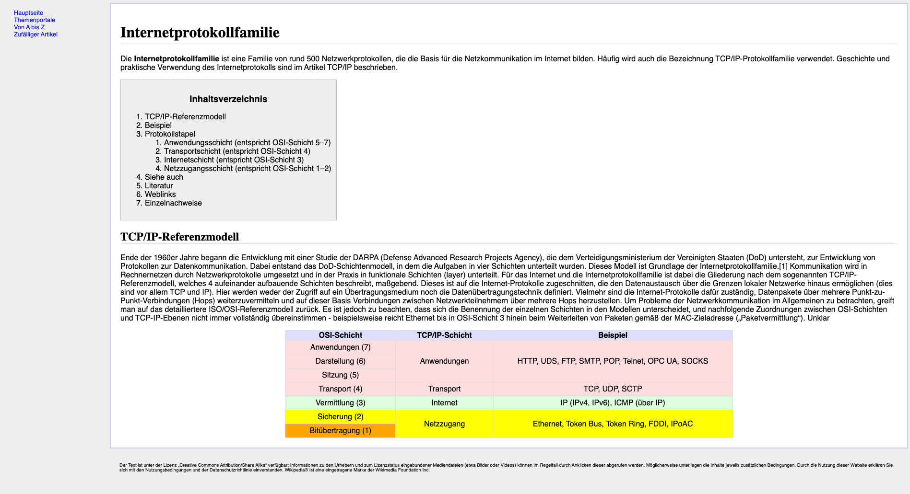

# Übung HTML und CSS
Erstelle die gesamte HTML Struktur und CSS Layout von dieser abgespeckten Wikipedia-Seite gemäss Screenshot.

## HTML
Erstelle zuerst die HTML Struktur.  
Achte dabei auf eine semantisch korrekte Struktur, verwende die HTML5 Strukturelemente und validiere am Schluss die Seite im HTML Validator.
Farben, Rahmen und Linien sind gestalterische Elemente, diese sollten nicht in HTML erstellt werden.

## CSS
Gestalte die Seite mittels CSS. 
Verwende möglichst wenige `class` und `id` Attribute im HTML Code.
Nutze nur relative Einheiten (`em`, `rem`)
   1. Erstelle dazu zuerst das Layout für Mobilgeräte. 
   2. Erstelle anschliessend die Version für grössere Geräte mit Grid-Layout.
   3. Erstelle mit `flex` und `grid` eine alternative Version, bei der das Menü horizontal über dem Inhalt ist statt links daneben.
   4. Experimentiere mit den verschiedenen Farbsystemen (Farbnamen, Hex, RGB(A) HSL(A) )

## Barrierefreiheit
Untersuche, ob die Webseite so barrierefrei ist. 
Notiere deine Erkenntnisse und erweitere die Seite:
   1. Semantische HTML Elemente
   2. Korrekte Verwendung von Überschriften
   3. Korrekte Tabellen
