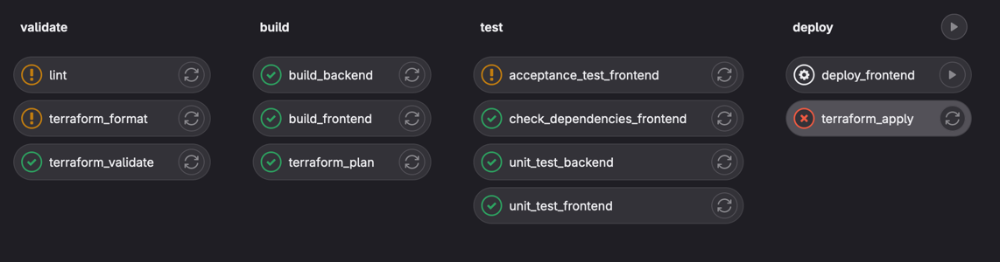

# Deployment

## Lernziele

Die Studierenden können Applikationen containerisieren und deployen.

Die Studierenden kennen die Struktur und Aufgaben einer Deployment-Pipeline und können selber eine einfache Deployment-Pipeline erstellen.

## Vorgehen

Als Grundlage für spätere Übungen erstellen und deployen wir einen containerisierten Webserver.

Erstelle dazu eine [einfache HTML-Seite](https://www.w3schools.com/html/html_basic.asp) oder nutze die Seite aus der vorgängigen Übung.

Halte alle ausgeführten Befehle und deren Erläuterung in einem Markdown File fest.
So kannst du später die Arbeit exakt nachvollziehen und gegebenenfalls automatisieren.

## Docker Container

Packe die Website in einen Docker Container

1. Installiere und starte dazu zuerst [Docker Desktop](https://www.docker.com/).
2. Erstelle ein Dockerfile im Wurzelverzeichnis:

```Dockerfile
FROM nginx:latest

COPY . /usr/share/nginx/html

RUN chmod g+rx -R /usr/share/nginx/html
```

3. Erstelle und starte anschliessend das container image. Du solltest nun die Webseite auf `localhost` im Browser erreichen.

```shell
docker build . --tag webengineering
docker run --name webengineering --detach --publish 80:80 webengineering 
```

4. Stoppe den Container mit `docker stop webengineering` und lösche ihn mit `docker rm webengineering`
5. Erstelle ein docker-compose file:

```yaml
version: "1"
services:
  web:
    build: .
    container_name: webengineering
    restart: always
    ports:
      - "80:80"
```

5. Nun kannst du den container mit `docker-compose up` starten. Nutze `docker-compose up --build` um das Image vor dem Starten neu zu builden.

## Deployment

Deploye den Container auf Azure. Nutze dazu Azure CLI und halte die ausgeführten Befehle fest. 

1. [Installiere Azure CLI](https://learn.microsoft.com/en-us/cli/azure/install-azure-cli) und logge dich mit `az login`
   in deinen Account ein.
2. Deploye anschliessend den Container gemäss [Anleitung](https://learn.microsoft.com/en-us/azure/container-instances/container-instances-tutorial-prepare-acr). Wähle mit der Option `--location` eine Region in der Nähe:  `az group create --name tekoTest --location switzerlandnorth`

Stelle sicher, dass du am Ende wieder alle Ressourcen gelöscht hast, damit nicht unnötig Kosten entstehen oder Guthaben aufgebraucht wird. Der Befehl `az group delete --name myResourceGroup` löscht die gesamte resource group. `az group list` sowie `az container list` sollten keine Ressourcen mehr anzeigen.

## Deployment Pipelines

### Gitlab CI

Untersuche die gegebene [Gitlab Deployment Pipeline](gitlab-ci-example.yml).



- Welche Stufen sind definiert?
- Welche Schritte haben die einzelnen Stufen?
- Welche Abhängigkeiten existieren?
- Wann werden die einzelnen Schritte ausgeführt?
- Welche Schritte erzeugen ein Resultat? Welches?
- Welche Punkte aus [Dave Farleys Video](https://youtu.be/x9l6yw1PFbs?feature=shared) werden umgesetzt? Welche nicht?

### Github Actions

Erstelle auf Github eine einfache Deployment-Pipeline.

Wähle aus den folgenden Punkten:

- Statische Code Analyse / Linting
- Automatisierte Unit-Tests
- Coverage Report Deployment auf Github Pages
- Überprüfen der Abhängigkeiten
- Build und deployment des oben erstellten Containers auf Azure [gemäss Anleitung](https://learn.microsoft.com/en-us/azure/container-instances/container-instances-github-action?tabs=userlevel)

Konsultiere dazu die [ausführliche Dokumentation](https://docs.github.com/en/actions), das "[Quickstart](https://docs.github.com/en/actions/quickstart)" und die zahlreichen [Beispielworkflows](https://github.com/actions/starter-workflows).
   

