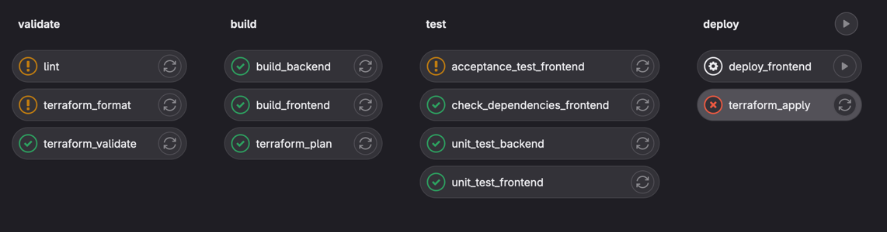

# Deployment Pipelines
## Lernziele
Die Studierenden kennen die Struktur und Aufgaben einer Deployment-Pipeline und können selber eine einfache Deployment-Pipeline erstellen.

## Aufgaben

### Gitlab CI

Untersuche die gegebene [Gitlab Deployment Pipeline](gitlab-ci-example.yml).

- Welche Stufen sind definiert?
- Welche Schritte haben die einzelnen Stufen?
- Welche Abhängigkeiten existieren?
- Wann werden die einzelnen Schritte ausgeführt?
- Welche Schritte erzeugen ein Resultat? Welches?
- Welche Punkte aus [Dave Farleys Video](https://youtu.be/x9l6yw1PFbs?feature=shared) werden umgesetzt? Welche nicht?

### Github Actions
Erstelle auf Github eine einfache Deployment-Pipeline für das Projekt aus der [Übung 05_NodeJS](../05_NodeJS):
- Statische Code Analyse / Linting
- Automatisierte Unit-Tests
- Coverage Report Deployment auf Github Pages
- Überprüfen der Abhängigkeiten

Die Ausführung der Akzeptanztests in der Pipeline sprengen leider den Rahmen dieser Übung.

Konsultiere dazu die [ausführliche Dokumentation](https://docs.github.com/en/actions), das "[Quickstart](https://docs.github.com/en/actions/quickstart)" und die zahlreichen [Beispielworkflows](https://github.com/actions/starter-workflows).