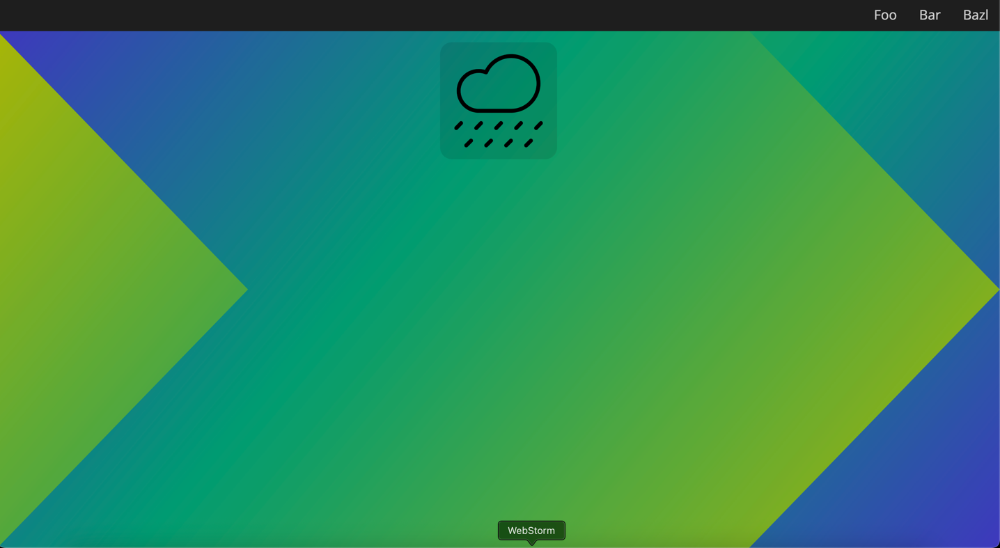

# Advanced CSS

## Lernziele

Die Studierenden

- können einfache Stylesheets erstellen und einbinden und dabei Selektoren, Farben, Einheiten korrekt verwenden.
- können einfache Mehrspaltenlayouts erstellen
- können einfache Animationen erstellen
- können komplexere Layouts nur mit CSS erstellen

## Aufgabenstellung

Erstelle die HTML-Struktur und CSS-Layout der [beliegenden Website](index.html):

Öffne dazu die Seite im Browser, ohne die Source anzuschauen.

Für das Erreichen der Lernziele ist es nicht nötig, die Website vollständig umzusetzen.
Wähle selber Themen, die du üben möchtest.
