<!-- headingDivider: 3 -->

# Grundlagen
## Client - Server


## URL
`https://www.philipackermann.de:80/books/web.html?language=de#chapter7`

## Aufbau von Webapplikationen
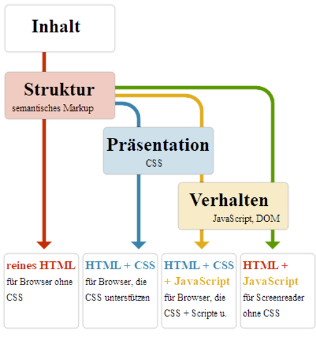

## Software Stacks
### LAMP
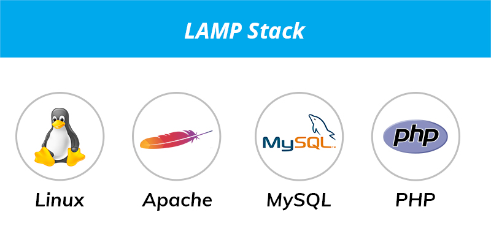

### MERN
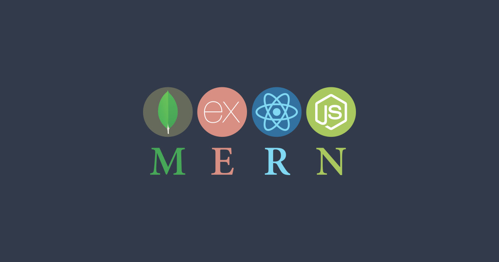


## Werkzeuge
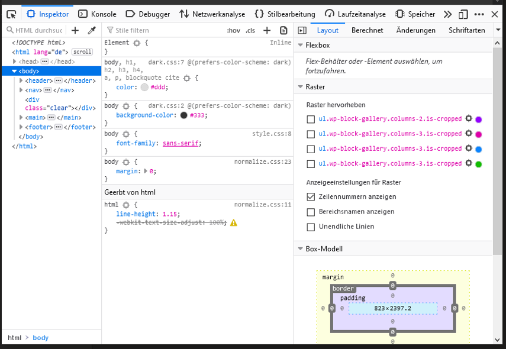

# Webseiten strukturieren mit HTML
## Barrierefreiheit
### Gerätevielfalt
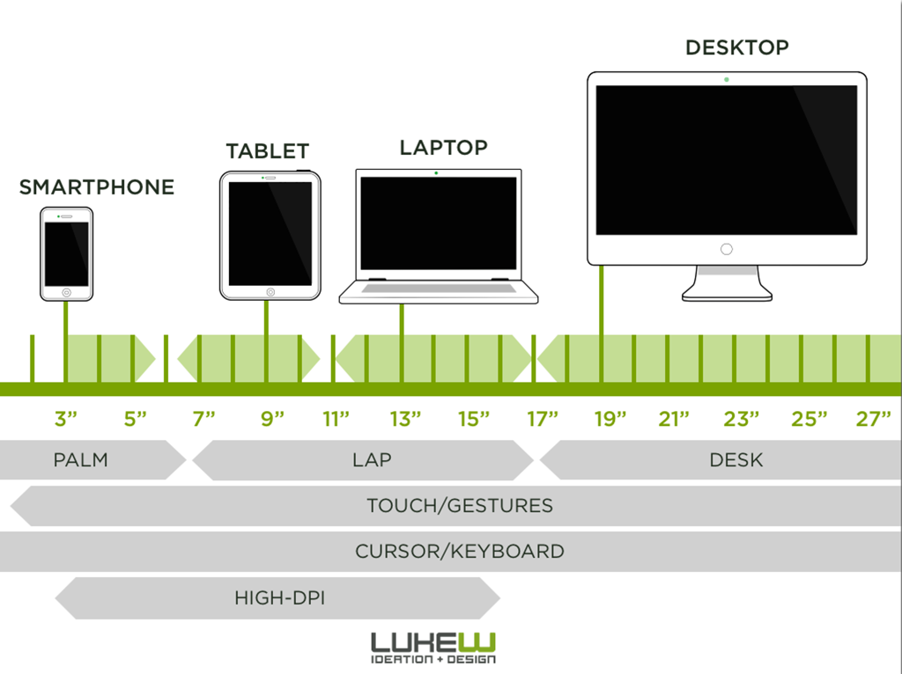

### Browser Wars

---
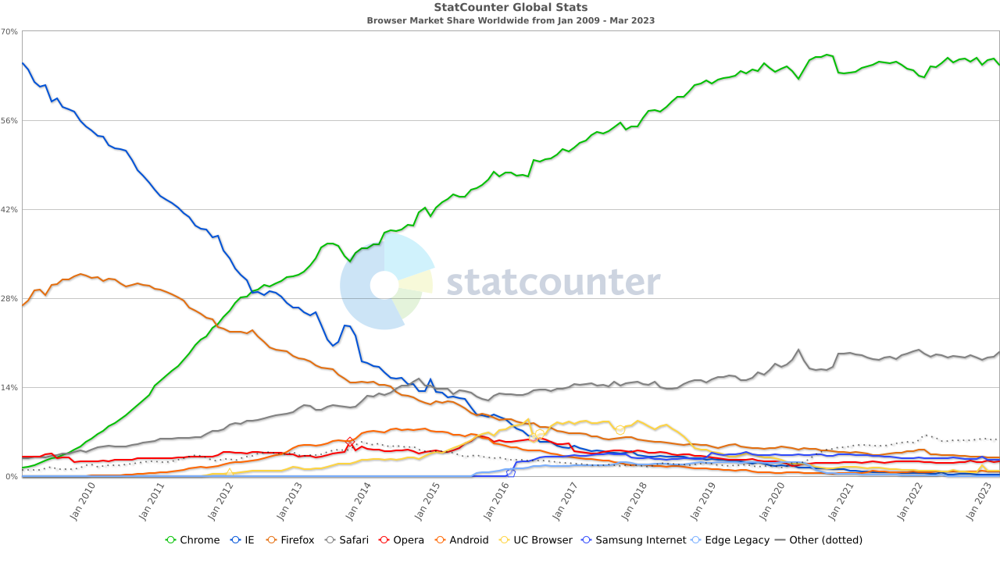
---


## Layoutkonzepte
* http://info.cern.ch/hypertext/WWW/TheProject.html
* Framesets
* Tabellen
* Cascading Style Sheets (CSS)
* Fixed vs. Liquid Layout
* Responsive Webdesign
* Device Agnostic
* Mobile First

## Grundstruktur
```html
<!DOCTYPE html>
<html lang="de">
  <head>
    <meta charset="utf-8">
    <meta name="viewport" content="width=device-width, initial-scale=1.0">
    <title>Titel</title>
  </head>
  <body>

  </body>
</html>
```

# Webseiten gestalten mit CSS
## Box Model
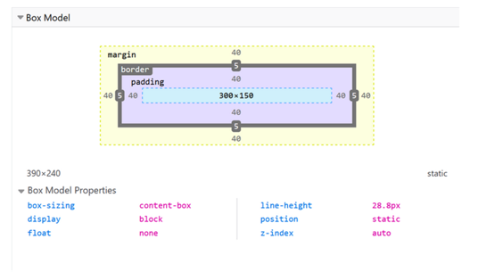
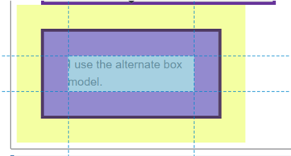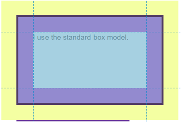


## Einheiten
- Absolute Grössen: `px` (`cm` ,`mm`, ...) -> sparsam verwenden
- Relative Grössen
  - `em`: Schriftgrösse des Elternelements
  - `rem`: Schriftgrösse des Wurzelelements
  - `vw`, `vh`: viewport breite, viewport höhe
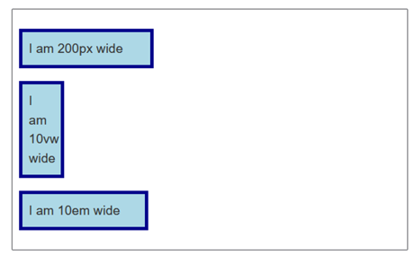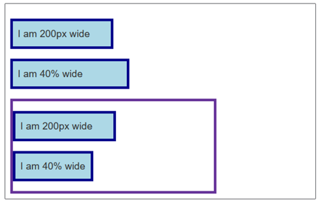

## Farben
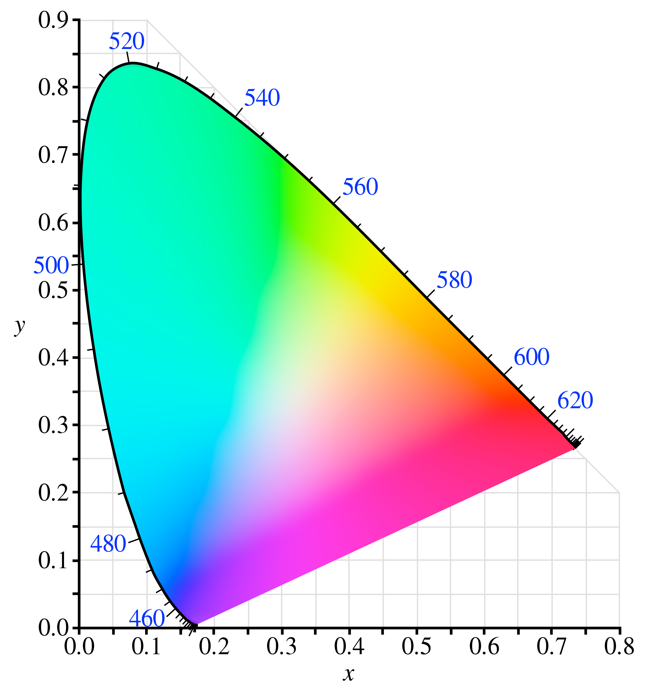
CIE 1931 Farbraum

---

### Vergleich Farbräume
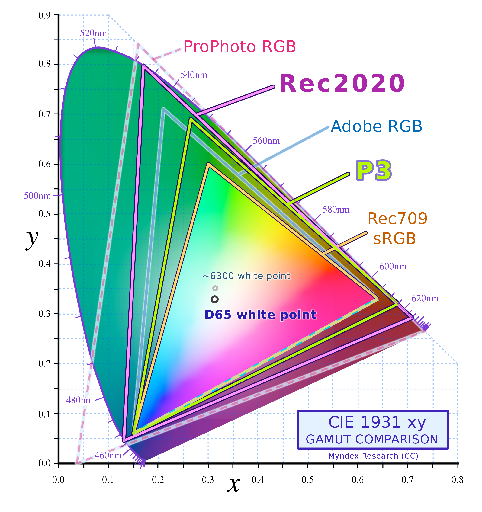

---

### Farben in CSS
#### sRGB Farbraum
- Farbnamen: `color: darkblue;`
- Hex-Werte: `color: #ffa500;`
- RGBA-Werte (mit Deckkraft): `color: rgba(169, 169, 169, 0.5)`
- HSL-Werte (Hue, Saturation, Lightness): `color: hsl(60, 100, 50)`

---

#### Alle sichtbaren Farben
- LCH (Lightness Chroma Hue / Opacity): `color: lch(29.2345% 44.2 27 / 0.5)`
- Oklch: `color: oklch(40.1% 0.123 21.57)`
- CIELAB (Lightness, red-green, blue-yellow): `color: lab(29.2345% 39.3825 20.0664);`
- Oklab: `color: oklab(40.1% 0.1143 0.045);`

---

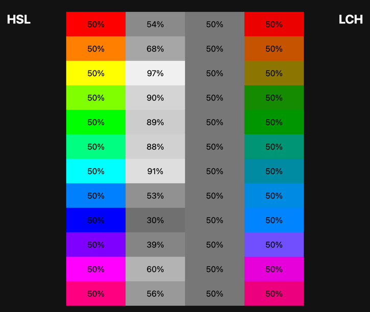
https://codepen.io/web-dot-dev/pen/poZgXxy


# Webanwendungen deployen und hosten

## CI / CD
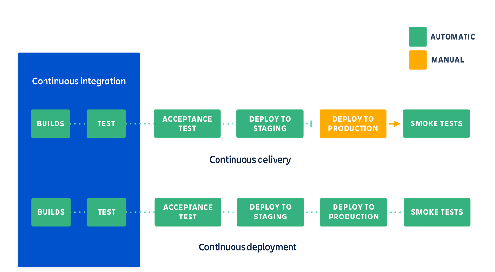

## Continuous Integration
- Kein Branching, alle Änderungen werden von allen Teammitgliedern mehrmals täglich in den Master Branch eingecheckt.
- Dieser Branch ist jederzeit lauffähig
- Dadurch werden die Releases vereinfachen
- Eine sehr hohe, automatische Testabdeckung ist zwingend
 
## Continuous Delivery
- Low risk releases
- Faster time to market
- Higher quality
- Lower costs
- Better products
- Happier teams

## Principles
- Build quality in
- Work in small batches
- Computers perform repetitive tasks, people solve problems
- Relentlessly pursue continuous improvement
- Everyone is responsible

https://www.continuousdelivery.com/

[Modern Software Engineering](https://www.amazon.com/Modern-Software-Engineering-Discipline-Development/dp/0137314914)

## Begriffe
GitOps: Git als Single Source of Truth für alles was für die Applikation relevant ist.


## Webanwendungen organisieren und verwalten
# Webseiten interaktiv machen mit JavaScript
vgl.: Douglas Crockford (2018): How JavaScript Works, virgule solidus

## How Class Free Works
- Klassen sind syntaktischer Zucker, d.h. sie bieten keine Funktionalität, die nicht mit anderen Mitteln erreicht werden kann.
- Sie verhalten sich anders als Klassen in C++, Java oder C#. Das kann verwirrend sein.

### Komposition
- Vererbung ist weniger zentral als manche Sprachen oder Kurse vermitteln. 
- Vererbung bringt auch einige Probleme mit sich, da die Klassen sehr eng gekoppelt sind und nicht explizit klar ist, welche Methoden aufgerufen werden.
- Komposition ist sehr leistungsfähig.

---

Folgende Struktur wird empfohlen:
```JavaScript
function counter_constructor() {
    // private property
    let counter = 0;
  
    // composition
    const reuse = other_constructor();
    
    function up() {
        counter -= 1;
        return counter;
    }
    
    function down() {
        counter += 1;
        return counter;
    }
    
    // freeze to make the object immutable
    return Object.freeze({
      // make functions up and down public
      up,
      down,
      // expose goodess property from another object
      goodness: reuse.goodness
    })
}
```

## Asynchronität

- JavaScript wurde primär für User-Interaktionen entwickelt.
- Asynchronität ist deshalb ein zentrales Sprachfeature.
- Es gibt verschiedene Möglichkeiten für asynchronen Code:
  - Callbacks
  - Promise
  - `async` / `await`

`async` / `await` ist verwirrend, weil damit Code produziert wird, der synchron aussieht, aber asynchron funktioniert.

### Callback-Funktionen

- Callback-Funktionen werden als Parameter einer Funktion übergeben und von dieser aufgerufen.
- Die sogenannt "Callback-Hell", gemeint ist die Verschachtelung von Callbacks in Callbacks, sollte vermieden werden.

```javascript
function foo(callback) {
  // some functionality
  
  callback(value);
}

foo((value) => {
    // runs after "some functionality"
})
```

### Promise

Promises können klarer sein als Callbacks, sind aber auch weniger explizit und potenziell verwirrend.
```javascript
const p1 = new Promise((resolve, reject) => {
  // some functionality
  
  resolve("Success!");
});
p1.then((value) => {
    // runs after "some functionality"
  }
);

```

# Web-APIs verwenden
# Webanwendungen testen
# Webprotokolle verwenden
## HTTP
## Websockets
# Webformate verwenden
## Rastergrafiken
## Vektorgrafiken
# Single-Page-Applikationen implementieren
# JavaScript auf der Serverseite verwenden
# Webservices implementieren
## REST
# Daten in Datenbanken speichern
# Webanwendungen absichern
# Die Performance von Webanwendungen optimieren
