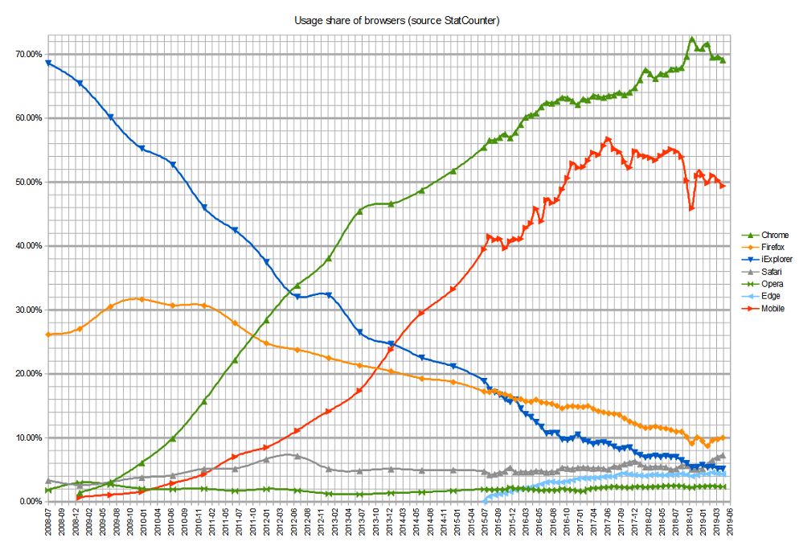

<!-- headingDivider: 2 -->

# Grundlagen
## Client - Server


## URL
`https://www.philipackermann.de:80/books/web.html?language=de#chapter7`

## Aufbau von Webapplikationen


## Werkzeuge


# Webseiten strukturieren mit HTML
## Grundstruktur
```html
<!DOCTYPE html>
<html lang="de">
  <head>
    <meta charset="utf-8">
    <meta name="viewport" content="width=device-width, initial-scale=1.0">
    <title>Titel</title>
  </head>
  <body>

  </body>
</html>
```

## Barrierefreiheit
### Gerätevielfalt


### Browser Wars

---


# Webseiten gestalten mit CSS
## Layoutkonzepte
* http://info.cern.ch/hypertext/WWW/TheProject.html
* Framesets
* Tabellen
* Cascading Style Sheets (CSS)
* Fixed vs. Liquid Layout
* Responsive Webdesign
* Device Agnostic
* Mobile First

## Einbindung
## Selektoren
## Box Model
## Einheiten
## Farben
## Flexbox
## Grid
## Media Queries
# Webanwendungen deployen und hosten
## Webanwendungen organisieren und verwalten
# Webseiten interaktiv machen mit JavaScript
# Web-APIs verwenden
# Webanwendungen testen
# Webprotokolle verwenden
## HTTP
## Websockets
# Webformate verwenden
## Rastergrafiken
## Vektorgrafiken
# Single-Page-Applikationen implementieren
# JavaScript auf der Serverseite verwenden
# Webservices implementieren
## REST
# Daten in Datenbanken speichern
# Webanwendungen absichern
# Die Performance von Webanwendungen optimieren
