<!-- headingDivider: 4 -->

# Grundlagen "Web-Engineering"

## World Wide Web


"HyperText is a way to link and access information of various kinds as a web of nodes in which the user can browse at will. Potentially, HyperText provides a single user-interface to many large classes of stored information such as reports, notes, data-bases, computer documentation and on-line systems help. We propose the implementation of a simple scheme to incorporate several different servers of machine-stored information already available at CERN, including an analysis of the requirements for information access needs by experiments."

(https://www.w3.org/Proposal.html)

---

Das **World Wide Web** (englisch für „weltweites Netz“, kurz Web oder WWW) ist ein über das **Internet** abrufbares System von [...] sogenannten **Webseiten**, welche mit **HTML** beschrieben werden.

Sie sind durch **Hyperlinks** untereinander verknüpft und werden im Internet über die Protokolle **HTTP oder HTTPS** übertragen.

Zum Aufrufen von Inhalten aus dem World Wide Web wird ein **Webbrowser** benötigt, der z. B. auf einem **PC** oder einem **Smartphone** läuft. Mit ihm kann der Benutzer die auf einem beliebigen, von ihm ausgewählten **Webserver** bereitgestellten Daten herunterladen und auf einem geeigneten Ausgabegerät wie einem **Bildschirm** oder einer **Braillezeile** anzeigen lassen.

(vgl. https://de.wikipedia.org/wiki/World_Wide_Web)

## Engineering

Engineering is the practice of using **natural science**, **mathematics**, and the **engineering design** process to solve **technical problems**, increase **efficiency** and **productivity**, and **improve systems**.

The **engineering design process** is a common series of steps that engineers use in creating **functional products and processes**. The process is **highly iterative**[...]

It is a **decision making process** in which the **basic sciences** [...] are **applied** to convert resources optimally **to meet a stated objective**.

Among the fundamental elements of the design process are the **establishment of objectives and criteria**, **synthesis**, **analysis**, **construction**, **testing** and **evaluation**.

(vgl. https://en.wikipedia.org/wiki/Engineering,  https://en.wikipedia.org/wiki/Engineering_design_process)

---

- **Anwendung von Wissenschaften**
- Lösen von technischen Problemen, erhöhen der Effizienz, Optimierung von Systeme
- **Iterativer Prozess**
- Entscheidungsverfahren
- Bestimmen der Anforderungen und **Analyse**, **Herstellung**, **Überprüfung** und **Evaluation**

## History of the Web

### Web 1.0

- WWW (1989): Tim Berners-Lee, CERN: https://info.cern.ch/hypertext/WWW/TheProject.html
- HTTP (1991): https://datatracker.ietf.org/doc/html/rfc1945
- W3C (1994): https://www.w3.org/

(vgl. https://en.wikipedia.org/wiki/History_of_the_World_Wide_Web)

### dot-com bubble

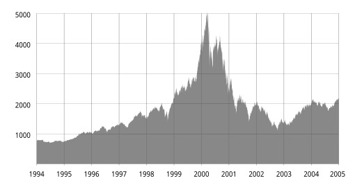
Nasdaq Composite index

https://en.wikipedia.org/wiki/Dot-com_bubble

### Web 2.0

- Social Media: Youtube (2005), Facebook (2004), MySpace (2003), Twitter (2006)
- JavaScript (1995): Brendan Eich, Netscape
- Ajax (2000): XMLHttpRequest
- Web Applications, SPA, PWA: Gmail (2004), Google Maps (2005)
- Cloud Computing: AWS (2002)
- Mobile: iPhone (2007)

### Browser Wars

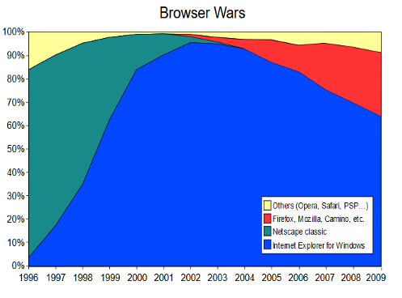

---

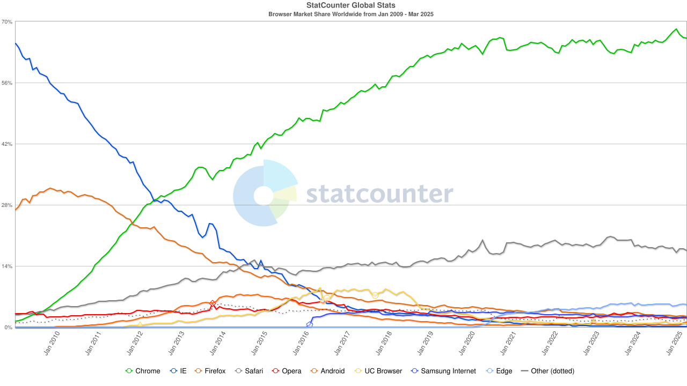

https://gs.statcounter.com/browser-market-share#monthly-200901-202503

---
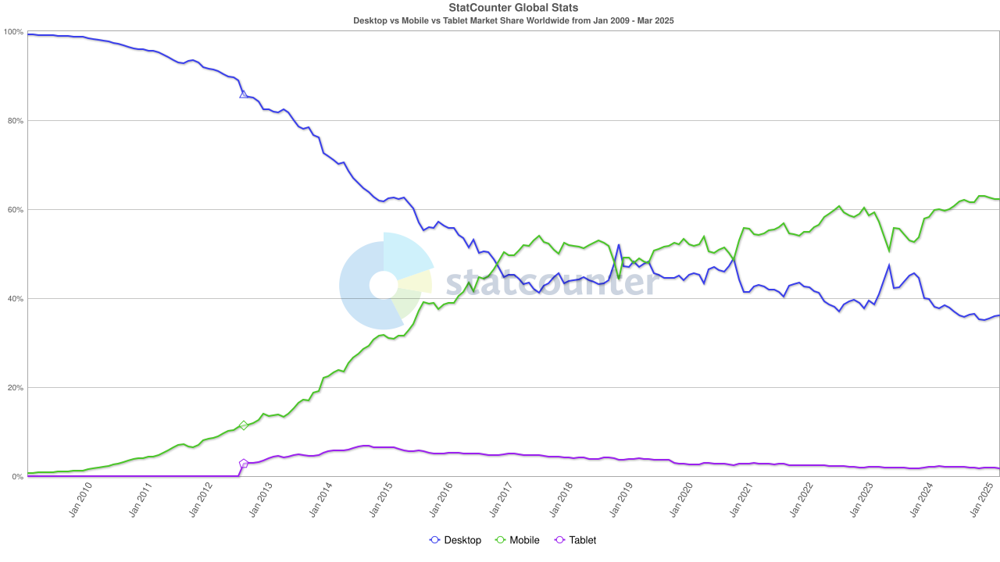

https://gs.statcounter.com/platform-market-share/desktop-mobile-tablet/worldwide/#monthly-200901-202503

### Web 3.0 / Semantic Web

- Tim Berners-Lee, 1999
- Daten werden mit Metadaten maschinenlesbar aufbereitet
- Dadurch können Informationen verlinkt werden
- Beispiel: RSS, https://hnrss.org/frontpage

### Web3

- Dezentrales Web
- Blockchains
- smart contracts
- digital tokens

### Gegenwart und Zukunft

- Browser als App-Plattform
- Local First: https://localfirstweb.dev/
- Internet of Things?
- "Dead Internet Theory" / Enshittification / AI Slop
  - https://www.wired.com/story/tiktok-platforms-cory-doctorow/
  - https://www.zeit.de/digital/internet/2025-04/plattformverfall-enshittification-cory-doctorow-facebook-internet

## Werkzeuge

- https://developer.mozilla.org/
- https://www.mozilla.org/de/firefox/windows/
- https://www.google.com/intl/de/chrome/
- https://www.jetbrains.com/webstorm/
- Git: https://git-scm.com/
- Node.js: https://nodejs.org/en
- Docker: https://www.docker.com/
- [https://caniuse.com/](https://caniuse.com/)

[Tools.md](../Tools.md)

### Browser Tools: Inspektor

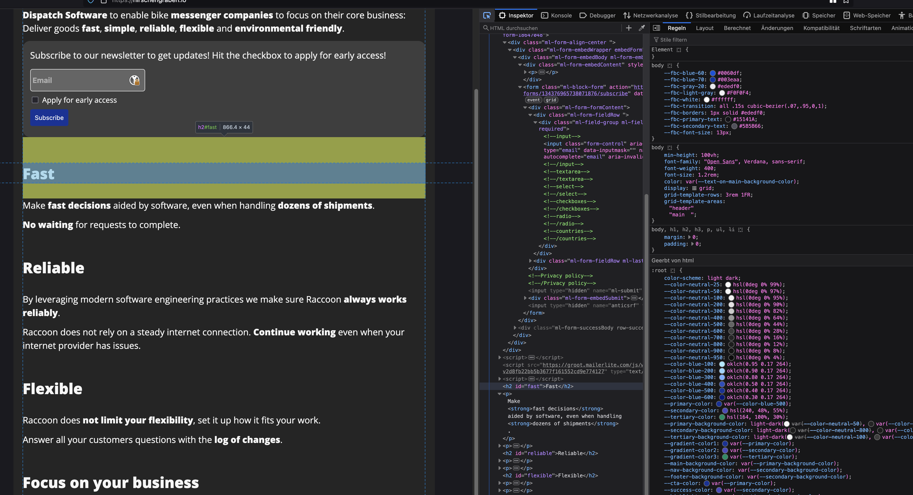

### Browser Tools: Netzwerkanalyse

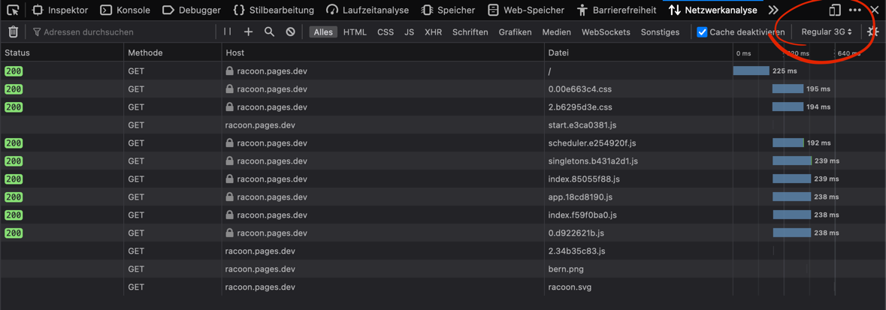

### Browser Tools: Laufzeitanalyse

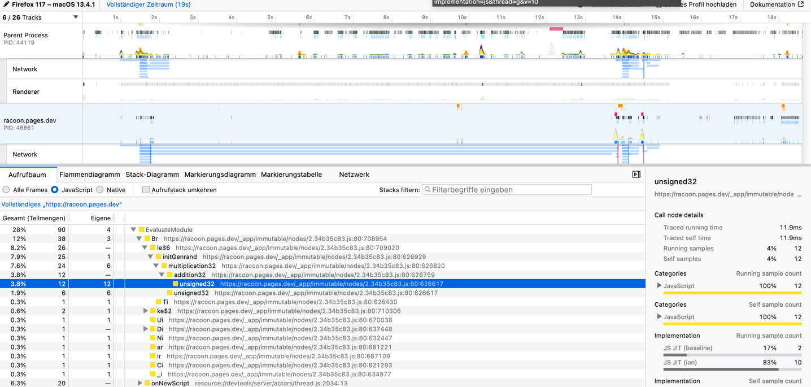

## Webseiten strukturieren mit HTML

### Sprache definieren

```html
<html lang="en-US">
  …
</html>
```

### Meta Daten

```html
<meta name="author" content="Chris Mills" />
<meta
  name="description"
  content="The MDN Web Docs site
  provides information about Open Web technologies
  including HTML, CSS, and APIs for both websites and
  progressive web apps." />

<meta charset="utf-8" />
<meta name="color-scheme" content="dark light" />
<meta name="viewport" content="width=device-width, initial-scale=1" />
```

### Icons

```html
<link rel="icon" href="/favicon.ico" />
<link rel="manifest" href="manifest.json" />
```

```json
// manifest.json
{
  "icons": [
    {
      "src": "basic-icon.png"
    }
  ]
}
```

## State of JavaScript

### Programmiersprachen

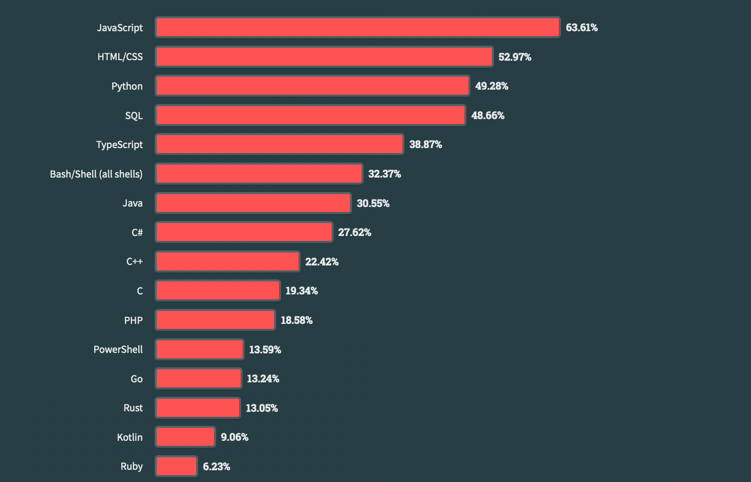

https://survey.stackoverflow.co/2023/#section-most-popular-technologies-programming-scripting-and-markup-languages,
23.04.24

### Datenbanken

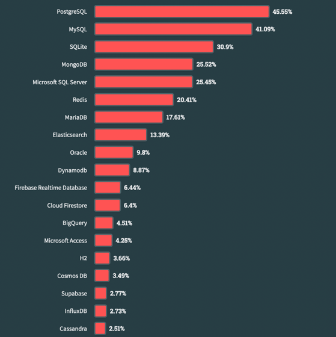

https://survey.stackoverflow.co/2023/#section-most-popular-technologies-databases, 23.04.24

### Cloud Plattformen

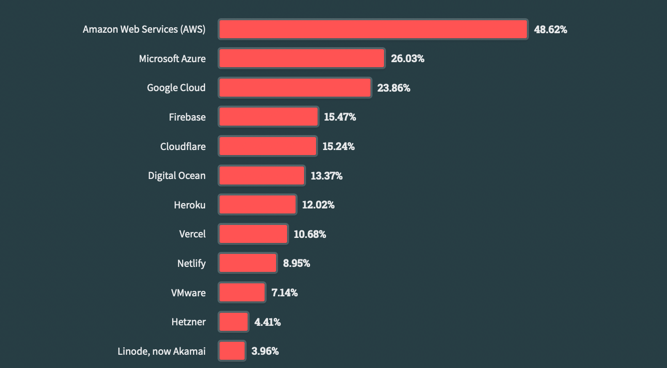

https://survey.stackoverflow.co/2023/#section-most-popular-technologies-cloud-platforms, 23.04.24

### Web Frameworks

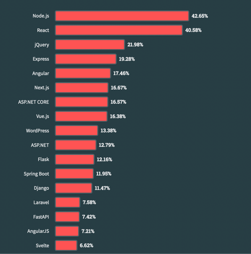

https://survey.stackoverflow.co/2023/#section-most-popular-technologies-web-frameworks-and-technologies, 23.04.24

---

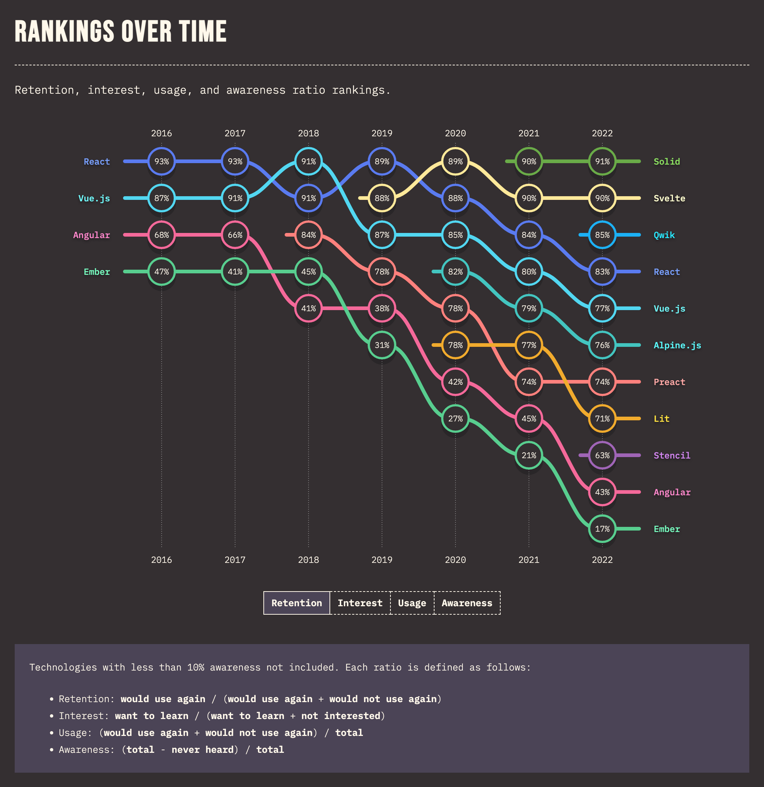
[State of JavaScript 2022](https://2022.stateofjs.com/), 21.06.2023


# Webseiten gestalten mit CSS

## Layoutkonzepte

* http://info.cern.ch/hypertext/WWW/TheProject.html
* Framesets
* Tabellen
* Cascading Style Sheets (CSS)
* Fixed vs. Liquid Layout
* Responsive Webdesign
* Device Agnostic
* Mobile First

## Box Model

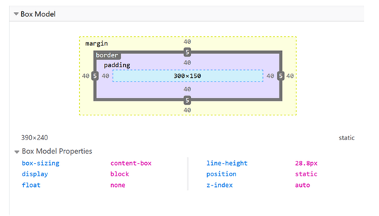

- `box-sizing: content-box`: `width` bezieht sich nur auf den content (blau, `300x150`)
- `box-sizing: border-box`: `width` bezieht sich auf content + padding + border (blau, violett, grau,
  `300+2*40+2*5` für die Breite)

## Einheiten

- Absolute Grössen: `px` (`cm` ,`mm`, ...) -> sparsam verwenden
- Relative Grössen
    - `em`: Schriftgrösse des Elternelements
    - `rem`: Schriftgrösse des Wurzelelements
    - `vw`, `vh`: viewport breite, viewport höhe
      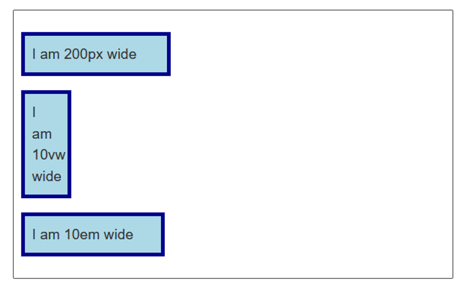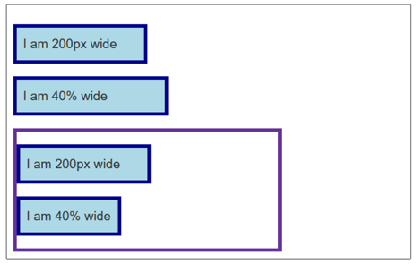

## Farben

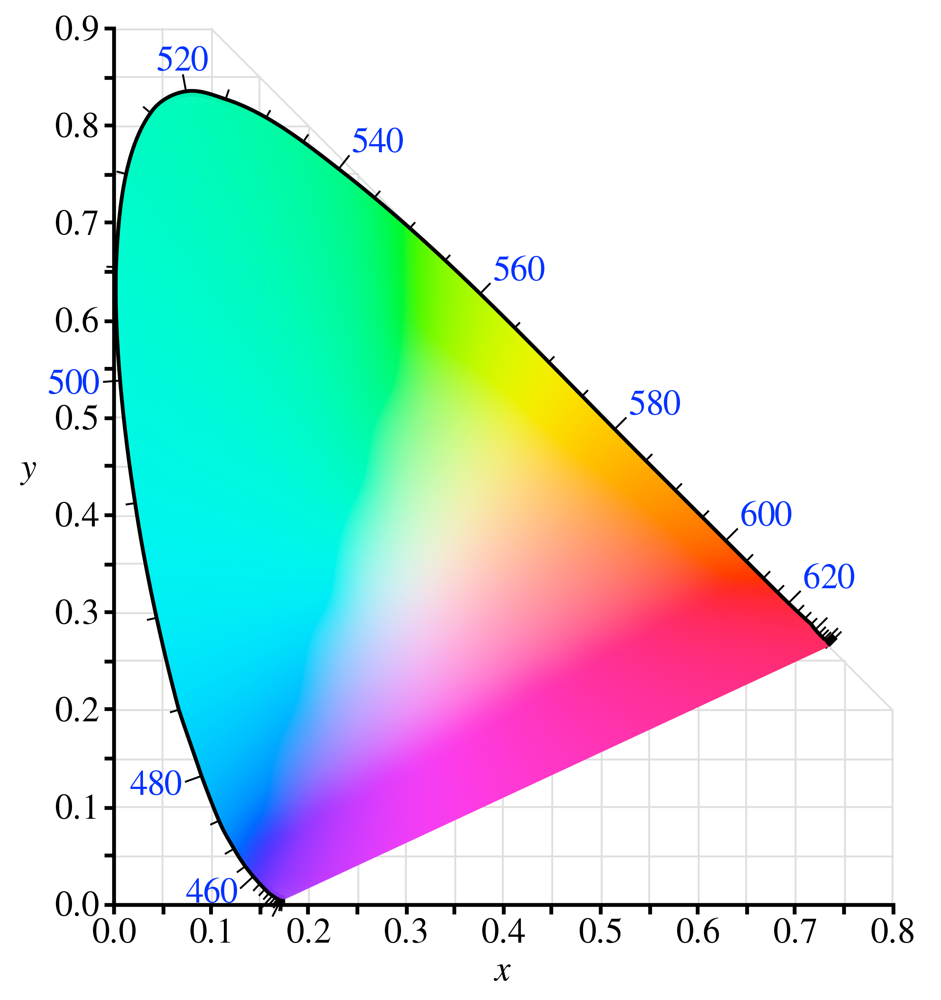
CIE 1931 Farbraum

### Vergleich Farbräume

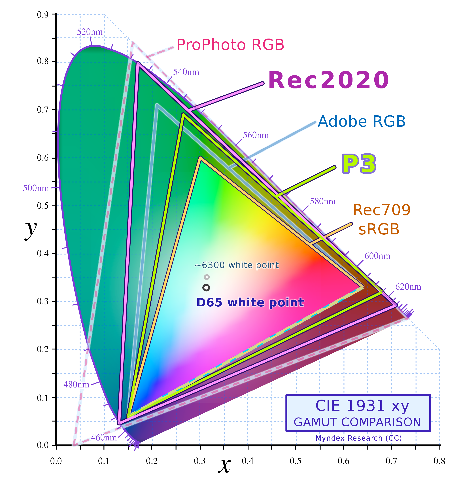

### Farben in CSS

#### sRGB Farbraum

- Farbnamen: `color: darkblue;`
- Hex-Werte: `color: #ffa500;`
- RGB-Werte (Rot, Grün, Blau, Deckkraft): `color: background: background: rgb(30% 20% 50%  / 0.7);`
- HSL-Werte (Farbe, Sättigung, Helligkeit, Deckkraft): `color: hsl(150deg 80% 40%  / 0.7);`

#### Alle sichtbaren Farben

- LCH (Lightness Chroma Hue / Opacity): `color: lch(29% 44 27 / 0.5)`
- Oklch: `color: oklch(40% 0.1 21)`
- CIELAB (Lightness, red-green, blue-yellow): `color: lab(29% 39 20);`
- Oklab: `color: oklab(40. 0.1 0.04);`

### HSL vs LCH

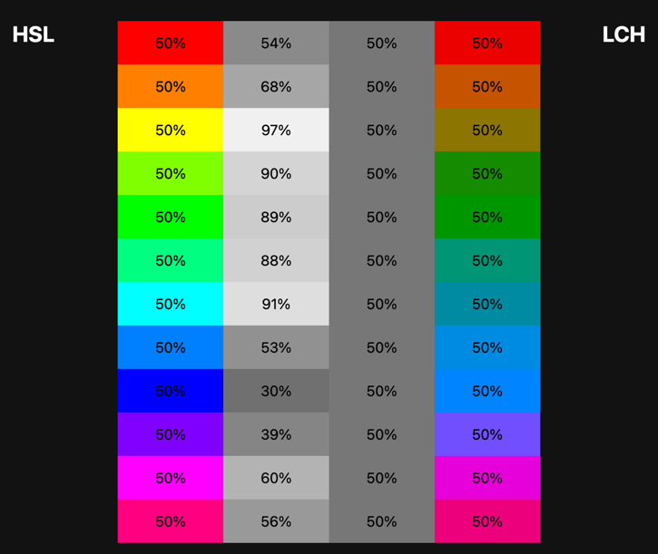

50% Luminance in HSL (links) vs in LCH (rechts)

https://codepen.io/web-dot-dev/pen/poZgXxy


### Farbsysteme

```css
:root {
  color-scheme: light dark;
  
  --color-neutral-25: hsl(0deg 0% 99%);
  --color-neutral-50: hsl(0deg 0% 97%);
  /* ... */
  --color-neutral-900: hsl(0deg 0% 8%);
  --color-neutral-950: hsl(0deg 0% 4%);
  
  --color-blue-100: oklch(0.95 0.17 264);
  --color-blue-200: oklch(0.90 0.17 264);
  /* ... */
  --color-blue-500: oklch(0.40 0.17 264);
  --color-blue-600: oklch(0.30 0.17 264);
  
  --primary-color: var(--color-blue-500);
  --secondary-color: hsl(240, 48%, 55%);
  
  --primary-background-color: light-dark(var(--color-neutral-50), var(--color-neutral-700));
  --secondary-background-color: light-dark(var(--color-neutral-800), var(--color-neutral-800));
  
  --main-background-color: var(--primary-background-color);
  --nav-background-color: var(--secondary-background-color);
  --footer-background-color: var(--secondary-background-color);
}
```

## CSS Functions

```css
color-scheme: light dark;

color: light-dark(#333b3c, #efefec);

width: max(20vw, 400px);
height: calc(10px + 100px);

filter: brightness(1);
backdrop-filter: blur(2px);

color-mix(in lch longer hue, hsl(200deg 50% 80%), coral)
```

https://developer.mozilla.org/en-US/docs/Web/CSS/CSS_Values_and_Units/CSS_Value_Functions
https://developer.mozilla.org/en-US/docs/Web/CSS/filter-function
https://developer.mozilla.org/en-US/docs/Web/CSS/color_value/color-mix

# Webseiten interaktiv machen mit JavaScript

vgl.: Douglas Crockford (2018): How JavaScript Works, virgule solidus

## How Class Free Works

- Klassen sind syntaktischer Zucker, d.h. sie bieten keine Funktionalität, die nicht mit anderen Mitteln erreicht werden kann.
- Sie verhalten sich anders als Klassen in C++, Java oder C#. Das kann verwirrend sein.

### "Composition over Inheritance"

- Vererbung ist weniger zentral als manche Sprachen oder Kurse vermitteln.
- Vererbung bringt auch einige Probleme mit sich, da die Klassen sehr eng gekoppelt sind und nicht explizit klar ist, welche Methoden aufgerufen werden.
- Komposition ist sehr leistungsfähig.

### Closures

Verschachtelte Funktionen können auf Variablen aus den äusseren Funktionen zugreifen.  
Auch nach deren Ausführung.

```javascript
function init() {
    const name = "Mozilla"; // name is a local variable created by init
  
    function displayName() {
        // displayName() is the inner function, that forms the closure
        console.log(name); // use variable declared in the parent function
    }
}
```

https://developer.mozilla.org/en-US/docs/Web/JavaScript/Closures

---

Folgende Struktur wird empfohlen:

```JavaScript
function counter_constructor() {
    // private property
    let counter = 0;

    // composition
    const reuse = other_constructor();

    function up() {
        counter -= 1;
        return counter;
    }

    function down() {
        counter += 1;
        return counter;
    }

    // freeze to make the object immutable
    return Object.freeze({
        // make functions up and down public
        up,
        down,
        // expose goodness property from another object
        goodness: reuse.goodness
    })
}
```

## Asynchronität

- JavaScript wurde primär für User-Interaktionen entwickelt.
- Asynchronität ist deshalb ein zentrales Sprachfeature.
- Es gibt verschiedene Möglichkeiten für asynchronen Code:
    - Callbacks
    - Promise
    - `async` / `await`

`async` / `await` ist verwirrend, weil damit Code produziert wird, der synchron aussieht, aber asynchron funktioniert.

### Callback-Funktionen

- Callback-Funktionen werden als Parameter einer Funktion übergeben und von dieser aufgerufen.
- Die sogenannt "Callback-Hell", gemeint ist die Verschachtelung von Callbacks in Callbacks, sollte vermieden werden.

```javascript
function foo(callback) {
    // some functionality

    callback(value);
}

foo((value) => {
    // runs after "some functionality"
})
```

### Promise

Promises können klarer sein als Callbacks, sind aber auch weniger explizit und potenziell verwirrend.

```javascript
const p1 = new Promise((resolve, reject) => {
    // some functionality

    resolve("Success!");
});
p1.then((value) => {
        // runs after "some functionality"
    }
);

```

# Single-Page-Applikationen implementieren

## Typische Dokumentstruktur

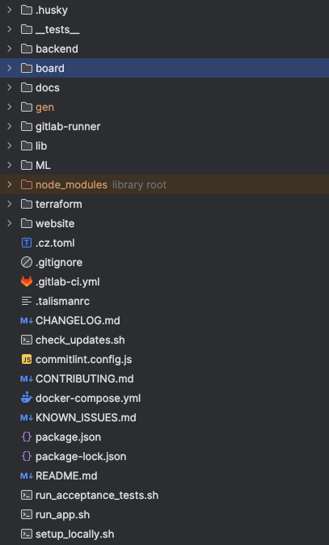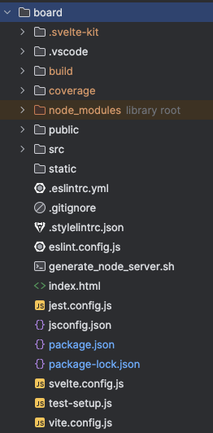

---

- **Docs:** README.md, CONTRIBUTING.md, LICENCE.md, etc
- **Configs:** `.gitignore`, `.talismanrc`, `commitlint.config.js`, `eslint.config.js`, `.dockerignore`,
  `jest.config.js`, `jsconfig.json`,
- **Build & Deployment:** `.gitlab-ci.yml`,`Dockerfile`, `docker-compose.yml`, `package.json`, `package-lock.json`
- **Render & build outputs:** `/dist`, `/build`, `/coverage`, `/node_modules`
- **Source Code:** `/src`

## Local First

1. No spinners: your work at your fingertips
2. Your work is not trapped on one device
3. The network is optional
4. Seamless collaboration with your colleagues
5. The Long Now
6. Security and privacy by default
7. You retain ultimate ownership and control

- https://www.inkandswitch.com/local-first/
- https://localfirstweb.dev/

# Webservices implementieren

- Level 0: The Swamp of POX
- Level 1: Resources
- Level 2: HTTP verbs
  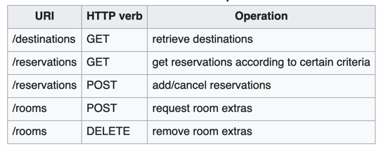
- Level 3: Hypermedia controls

```json lines
{
  customerId: "1",
  reservations: [
    {
      room: "102",
      checkin: "10-11-2020",
      checkout: "11-14-2020",
      price: "100",
      href: "https://localhost:8080/room/102"
    }
  ]
}
```

- https://en.wikipedia.org/wiki/Richardson_Maturity_Model
- https://martinfowler.com/articles/richardsonMaturityModel.html

# Die Performance von Webanwendungen optimieren

- Nachhaltige Software wird immer wichtiger
- [Wirth's law](https://en.wikipedia.org/wiki/Wirth's_law):

> "The hope is that the progress in hardware will cure all software ills. However, a critical observer may observe that software manages to outgrow hardware in size and sluggishness."

- Wettbewerbsvorteil
- https://www.blauer-engel.de/de/produktwelt/software

## Energy, Time, Memory Comparision

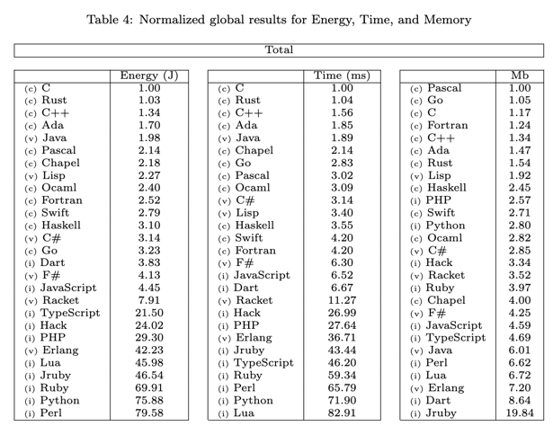

[https://haslab.github.io/SAFER/scp21.pdf](https://haslab.github.io/SAFER/scp21.pdf)
